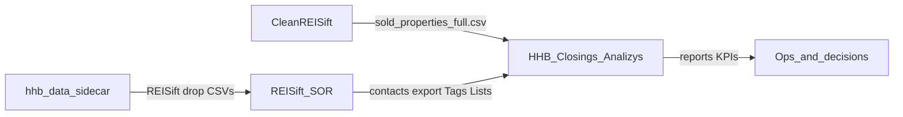

# HHB data apps — ecosystem map

Three codebases feed one operating picture. **Do not invent a fourth source of truth** for tags or pipeline stages. Closings owns **analysis grammar**; REISift remains the **system of record** for property/phone/Tags/Lists.

---

## Map

| App | Path | Owns |
|-----|------|------|
| **HHB Closings Analysis** | `D:\HHB-Closings-Analizys` | Gates 1–7 reports, `parse_tags` grammar, canonical marketing pipeline, Create Date = clock |
| **CleanREISift** | `D:\HHB\CleanREISift` | Sold scrape / enrich → Gate 7 input (`sold_properties_full.csv`, investor / in_my_records flags) |
| **hhb-data-sidecar** | `D:\hhb-data-sidecar` | Future ATTOM scoring + Golden Loop orchestration → REISift drop files (Tags, Lists, ATTOM ID) |

Operator SOP for Closings: [SOP.md](SOP.md).

---

## Responsibilities

### Closings (`HHB-Closings-Analizys`)

- Measures what already landed in REISift (and Gate 7 sold CSV).
- Canonical pipeline and Prospect sources: see [SOP.md](SOP.md).
- Deep rules: [REPORT_METHODOLOGY.md](REPORT_METHODOLOGY.md), ops: [RUNBOOK.md](../RUNBOOK.md).

### CleanREISift (`D:\HHB\CleanREISift`)

- Scrapes external sold transactions (Dataflik / REISift “In My Records” / investor flags).
- Output consumed by **Gate 7 only** as the sold universe.
- Before trusting Lost KPIs: every sold month’s In My Records scrape must show non-zero totals (see `RUN_ENRICH.md` / scrape logs).

### hhb-data-sidecar (`D:\hhb-data-sidecar`)

- Strategy (this folder): [Data Orchestration System.md](Data%20Orchestration%20System.md) (absolute: `D:\hhb-data-sidecar\Data Orchestration System.md`).
- Planned: ATTOM ingest → Property Score → Golden Loop channel batches → REISift CSV drops.
- Must emit tags Closings can parse (or update Closings parsers in the same change).

---

## Tag-contract tension (locked stance)

| Topic | Closings today (source of truth for analysis) | Sidecar strategy doc |
|-------|-----------------------------------------------|----------------------|
| Marketed / contact tags | `(8020) CC\|SMS\|DM - MM/YYYY` | Plans `(ATTOM) …` for ATTOM-sourced outreach |
| Prospect list credit | 8020 / Court Alerts / LI Profiles list tags | List-purchase style tags; ATTOM ID accumulation |
| Lifecycle ACQUIRED | Same Prospect list tag families via `parse_tags` | Older ACQUIRED→… table in sidecar doc |

**Rule:** Until Closings Marketed (and related parsers) explicitly support `(ATTOM)` contact tags, sidecar must **not** ship incompatible tag shapes and expect Gate 3/7 marketed rates to work. Prefer updating Closings + this ecosystem note in the same change set.

Closings **canonical marketing pipeline** (Prospect → … → Closed) supersedes the sidecar doc’s older ACQUIRED→… table when designing exports Closings will measure. Closings attribution lifecycle (ACQUIRED → … → CLOSED) remains valid for **closed-deal** path analysis and still keys off the same Prospect list tags.

---

## How to work across repos

1. Open Closings first for “what does the report mean?” → [SOP.md](SOP.md).
2. Change REISift drop / tag emission in sidecar → verify against Closings `parse_tags` / Gate 7 helpers; update methodology if grammar changes.
3. Change sold scrape in CleanREISift → re-run Gate 7; document flag columns (`investor`, `in_my_records`) if renamed.
4. Do **not** merge monorepos in this phase—keep three roots, one contract (this file + Closings SOP).
