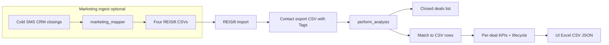

# Contact Attribution Report — Methodology

This document describes **how closings / contact attribution reports are computed** in this application: inputs, tag parsing, matching, counting rules, lifecycle, and exports. For operator workflows (REISift import order, Docker ports, API), see [RUNBOOK.md](../RUNBOOK.md).

**Canonical implementation:** `backend/app/services/analysis.py`, `backend/app/services/lifecycle.py`, `backend/app/services/marketing_mapper.py`.

---

## 1. Purpose and data flow

The report answers: **For each closed deal, what marketing touches happened before close, through which channels, and what lifecycle stages were reached?**

**Important:** Analysis reads the **REISift export CSV** (especially the **`Tags`** column). It does **not** read the Past patches zip directly. Tags from bulk import must appear on the export row after REISift processing.

---

## 2. Analysis modes

| Mode | Closed deals source | Match strategy |
|------|---------------------|----------------|
| **CSV-only (default)** | Derived from each row’s **`Tags`** (`derive_closed_deals_from_csv`) | Same row via **`csv_index`** — no fuzzy address match |
| **Legacy workbook** | Rows from uploaded closings **Excel** | **`match_deals_to_csv`** — normalized address + city (+ fallbacks) |

Optional API parameter **`as_of`** (`YYYY-MM-DD`): keep only deals with **`Date Closed` ≤ as_of** (calendar day). Supported on `POST /api/analyze`; not exposed in the current UI.

---

## 3. Minimum contact-history CSV

| Column | Required | Role |
|--------|----------|------|
| **`Tags`** | Yes | Comma-separated history: 8020 contacts, list/skip, `(SF)` CRM, `(CLOSED)` markers |
| **`Property address`** + **`Property city`** | Effectively yes | Combined into display/match address; if street empty, falls back to **`Address`** |
| **`Lead Source`** (variants) | No | Defaults to `"Contact History Tags"` when deriving deals |

**Row model:** One export row = one property’s full tag blob. Do not split history across rows.

See [RUNBOOK.md — Minimum Contact History CSV](../RUNBOOK.md#minimum-contact-history-csv-for-analysis) for safe trimming rules.

---

## 4. Tag parsing (`parse_tags`)

The **`Tags`** string is split on commas. Each token is matched against known patterns. Unrecognized tokens are ignored.

### 4.1 Recognized patterns

| Tag pattern | Parsed `type` | Date precision | Counted in CC/SMS/DM? |
|-------------|---------------|----------------|------------------------|
| `(8020) CC - MM/YYYY` or `MM-YYYY` | `contact` (channel CC) | Month → 1st of month | Yes, if before close |
| `(8020) SMS - …` | `contact` (SMS) | Month | Yes, if before close |
| `(8020) DM - …` | `contact` (DM) | Month | Yes, if before close |
| `List Purchased 8020 MM/YYYY` | `list_purchase` | Month | No |
| `Skip Traced … MM/YYYY` (optional Versium) | `skip_trace` | Month | No |
| `(CLOSED) 8020 - MM/YYYY` | `closing` | Month | No |
| `(SF) UPDATED - {status} - YYYY-MM-DD` | `sf_updated` | Day | No |
| `(SF) STATUS - {status} - YYYY-MM-DD` | `sf_status` | Day | No |

Implementation: `parse_tags` in `backend/app/services/analysis.py`.

### 4.2 Duplicate tag deduplication

After parsing, **`_dedupe_parsed_tag_events`** collapses tokens that describe the **same logical event**:

- **Dedupe key:** `(type, date, channel, label)`
- **Typical case:** Same tag imported twice to REISift (e.g. duplicate `(8020) CC - 1/2025`) → **one** event for counts and lifecycle.

This applies to **all** parsed types including `(CLOSED)` and `(SF)` lines.

Tests: `backend/tests/test_parse_tags_dedupe.py`.

### 4.3 What deduplication does *not* do

- **Different months** for the same channel (e.g. CC in Jan and CC in Feb) → **two** contacts.
- **Two CSV rows** for the same physical property → **two deals** in the report (no cross-row dedupe).
- **Path display:** `compute_ordered_path` only merges **consecutive identical** path tokens (e.g. `CC -> CC` becomes one `CC`), not all repeated CC events separated by other channels.

---

## 5. Deriving closed deals (CSV-only)

For each CSV row with non-empty **`Tags`**:

1. Parse and dedupe tags.
2. **Contract vs closed (default):**
   - **`Date Under Contract`** = earliest **`sf_updated` / `sf_status`** whose normalized label is in **`CONVERTED_LABELS`** (`converted`, `under contract`, … — Salesforce “converted” means under contract, not settlement closed).
   - **`Date Closed`** = earliest among **`closing`** events (`(CLOSED) 8020 - …`) only. SF converted/under contract **does not** qualify a row as closed.
3. If no **`closing`** event → row is not a closed deal (unless legacy mode; see below).
4. Row must have a non-empty combined address after address fallback logic.
5. Apply **`as_of`** cutoff if provided (compared to **`Date Closed`**).

**Workbook + tags:** When a legacy closings workbook is uploaded, **`Date Closed`** = **earliest** of workbook **`Date Closed`** and any **`(CLOSED)`** tag on the matched CSV row.

**Legacy mode:** Set environment variable **`USE_LEGACY_MIN_CLOSE_DATE=1`** to restore the old rule where SF converted dates could define **`Date Closed`** via `min(SF converted, CLOSED)`.

**Closings workbook Stage filter:** Rows with **`Stage`** are kept only when the stage is a closing type (**Closed**, **Executed**, **Funded**, **Closed Won**, etc.). **Closed Lost** and pipeline stages (Follow-up, etc.) are excluded. If no **`Stage`** column exists, all rows with a parseable close date are kept.

Month-granular **`(CLOSED)`** tags use the first day of that month internally for comparison.

---

## 6. Matching deals to contact rows

### 6.1 CSV-only path

Derived deals carry **`csv_index`**. Matching attaches the **same row’s** `Tags` for analysis — no address fuzzy match.

### 6.2 Legacy workbook path

`match_deals_to_csv` normalizes addresses (lowercase, abbreviation standardization, punctuation stripped) and tries, in order:

1. Exact normalized street + city  
2. City disambiguation when multiple CSV rows share a street  
3. Partial street match  
4. Street number + city  

Unmatched deals appear in results with **Match Found = false** and zero contact counts.

---

## 7. Per-deal metrics (`analyze_contacts`)

For each matched deal:

| Metric | Definition |
|--------|------------|
| **CC / SMS / DM Count** | Parsed **`contact`** events with date **strictly before** `Date Closed` |
| **Total Contacts** | Sum of CC + SMS + DM (not list/skip/SF/CLOSED) |
| **First / Last Contact Date** | Min/max among pre-close contact events |
| **Days to Close** | Close date minus first contact (approximate when tags are month-only) |
| **Contact Timeline** | Ordered channel list before close |
| **Closed Marker Date** | First **`closing`** event before close, if any |
| **List Purchased / Skip Traced Date** | First list/skip before close |

Lifecycle fields (funnel, path, SF trail, lifecycle events JSON) are computed from the same parsed events — see §8.

---

## 8. Lead lifecycle

Events are built with **`build_events`**, sorted by datetime then type rank (SF day events before month-granularity tags on the same day).

**Before-close rule:** Funnel, path, SF trail, and exported **Lifecycle Events** use only events with date **strictly before** the deal’s **`Date Closed`**.

### 8.1 Funnel stages

| Stage | Signal (first before close) |
|-------|----------------------------|
| **ACQUIRED** | `List Purchased 8020 …` |
| **RESEARCHED** | `Skip Traced …` |
| **FIRST_CONTACTED** | First `(8020) CC|SMS|DM …` |
| **ENGAGED** | `(SF) …` with label in **ENGAGED_LABELS** |
| **CONVERTED** | `(SF) …` with label in **CONVERTED_LABELS** |
| **CLOSED** | Always true for analyzed deals; date = deal close |

**Highest stage** ranks ACQUIRED → … → CONVERTED only; **CLOSED** is excluded from “highest” because every analyzed deal is closed.

### 8.2 Path sequence

Human-readable token chain (e.g. `LIST -> SKIP -> CC -> SF:follow_up -> CLOSED`). Consecutive duplicate tokens are collapsed once.

### 8.3 SF status trail

Chronological list of `(SF) UPDATED` / `(SF) STATUS` events before close (label + date + kind). Duplicate identical SF events are removed at parse dedupe step.

---

## 9. Summary / aggregate statistics

- **Match rate:** Share of closed deals with a matched CSV row.
- **Channel totals:** Sum of CC/SMS/DM counts **across deals** (each deal counted once per its row).
- **Lifecycle aggregates:** Per-stage reach rates over matched deals (`aggregate_lifecycle_stats`).

---

## 10. Past patches → REISift → analysis

**Past patches** (`marketing_mapper.run_patch_pipeline`) produces four CSVs:

| File | Purpose |
|------|---------|
| `property_status_updates.csv` | Property-level REISift status |
| `phone_status_tags_updates.csv` | Phone status + tags |
| `salesforce_status_tags.csv` | Rows that become **`(SF) UPDATED` / `(SF) STATUS`** tags in REISift |
| `closings_status_tags.csv` | **`(CLOSED) 8020 - M/YYYY`** month markers |

After REISift import and re-export, those strings live in **`Tags`** and feed §4–§8.

**CRM caveat:** `updated_on` must match the mapper’s Salesforce-style parser or UPDATED rows may be skipped (check preview metrics).

---

## 11. One-time Podio / offline ingest scripts

Not part of the web UI; for historical backfills:

| Script | Role |
|--------|------|
| `scripts/one_time_samples_reisift_zip.py` | Sample `Data_ingestion_samples` → REISift zip (Podio Closings adapted) |
| `scripts/one_time_podio_closings_opps_tags_bundle.py` | Podio Closings + Tina **New Opportunities** (Closed/Executed) merged closings tags + sidecar |
| `scripts/new_ingest_validate_and_bundle.py` | Validates slim `Report-*.xlsx` vs full address exports |
| `scripts/probe_contact_cadence_from_csv.py` | Offline gap stats between parsed events (experimental) |

Outputs land under `_ingest_out/<timestamp>/` with `ingest_metrics.json` and `README.txt`.

---

## 12. Experimental: cadence from history

**Module:** `backend/app/services/cadence_from_history.py`

Uses the same **`parse_tags`** + **`build_events`** pipeline to compute **inter-event day gaps** for offline experiments (e.g. informing future “Golden Loop” wait periods). **Not** used in production UI reports.

- **`summarize_tag_cadence(tags)`** — full timeline gaps  
- **`summarize_cadence_before_close(tags, closed_date)`** — gaps before close only  

**Limitation:** `(8020)` tags are **month-granular**; gaps are coarse unless `(SF)` day tags are present.

---

## 13. Exports

| Format | Contents |
|--------|----------|
| **Excel** | Results sheet + **Lifecycle Events** (one row per pre-close parsed event when available) |
| **CSV / JSON** | Flat result rows including lifecycle columns when run on current code |

Saved JSON from older runs may omit lifecycle fields; re-run analysis to populate.

---

## 14. Related documents

- [RUNBOOK.md](../RUNBOOK.md) — operations, playbooks, API, tag cheat sheet  
- [README.md](../README.md) — app overview and local/Docker setup  
- In-app **How the analysis works** — summary for analysts in the UI  

---

## 15. Code index

| Topic | Location |
|-------|----------|
| Tag parse + dedupe | `backend/app/services/analysis.py` — `parse_tags`, `_dedupe_parsed_tag_events` |
| Derive closings | `analysis.py` — `derive_closed_deals_from_csv` |
| Close vs contract rules | `closing_resolution.py` — `resolve_milestones_from_parsed`, `filter_closings_by_stage` |
| Workbook match | `analysis.py` — `match_deals_to_csv` |
| Contact KPIs | `analysis.py` — `analyze_contacts`, `perform_analysis` |
| Lifecycle | `backend/app/services/lifecycle.py` |
| REISift CSV export | `backend/app/services/marketing_mapper.py` — `export_outputs` |
| Cadence probes | `backend/app/services/cadence_from_history.py` |
| Dedupe tests | `backend/tests/test_parse_tags_dedupe.py` |
| Monthly consolidated (Gate 2) | `backend/app/services/monthly_consolidated.py` |
| Open pipeline / stuck-at-stage | `lifecycle.py` — `compute_stage_funnel_open`, `aggregate_stuck_at_stage` |
| Tag-derived lead source | `monthly_consolidated.py` — `derive_tag_lead_source` |

---

## 16. Gate 2 consolidated report additions

**Tag-derived lead source:** For each REISift cohort row, parse `Tags` chronologically. First `(8020) CC/SMS/DM` contact wins; if none, `LIST` when a `List Purchased 8020` tag exists; otherwise `NONE`. This is separate from Salesforce `Lead Source` on the qualified-leads export.

**Open pipeline (non-closing rows):** Cohort rows without `(CLOSED) 8020` tags are evaluated with the same lifecycle stage model, using events on or before the row `Created` date (or cohort period end). Highest stage reached is aggregated into **stuck-at-stage** counts (e.g. ENGAGED but not CONVERTED). Closing-cohort lifecycle and Top Paths remain closing-only.
